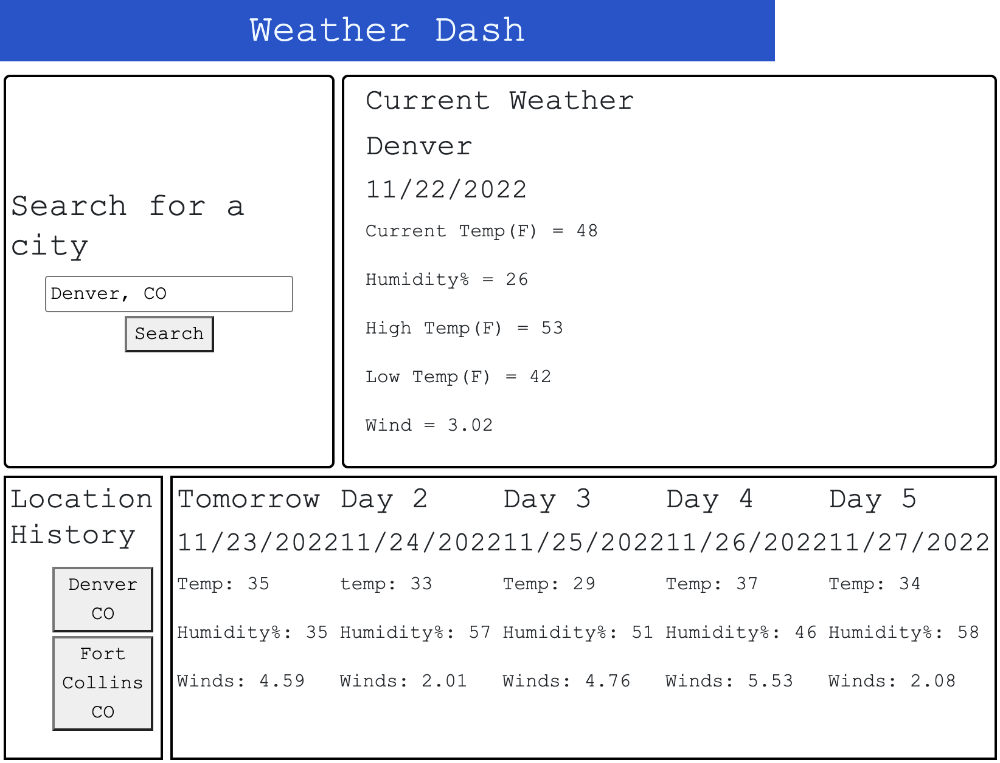

# weather-dashboard
make use of third party API to create a weather dashboard that will hold previous searches to click between and view weather results for each location

## Description
a webapp that will allow the user to search a [city, state], with results of the current and forecasted weather appearing on screen.
Past search history will be retained on screen, able to be clicked to recall the search results on screen. 

## Usage
type a city name and state code in the search bar top left, upon clicking the search button, current and forecasted weather will show up.
The searched for city will appear as an item beneath that can be clicked to recall the weather results. 

## Screenshot/Link
<!-- Screenshot works in preview -->

link: https://dylancas.github.io/weather-dashboard/

## Credits
Weather data and API usage provided by OpenWeatherMaps(https://openweathermap.org/)
